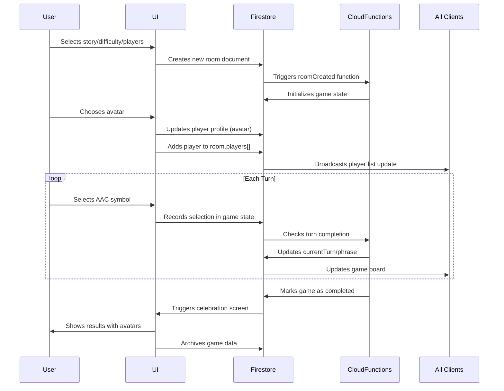

# System Block Diagram

*Figure 1: System block diagram showcasing interaction between users, frontend, and backend.*

## Diagram of Gameplay Flow

## Technology Requirements

### Frontend / Client-side
The frontend uses a Next.js framework (TypeScript) hosted with Firebase. The UI is styled using TailwindCSS, and FramerMotion (smooth animation). The word bank will have appropriate buttons that will look like ARASAAC, a widely accepted AAC Keyboard variations.

### Backend / Server-Side

The backend uses Firebase for cloud functions and data storage. Firebase cloud functions are used to handle game logic, while a Cloud Firestore NoSQL database securely stores user data and game material (stories and questions). Firebase also facilitates user authentication for joining the room with the correct QR code. 
