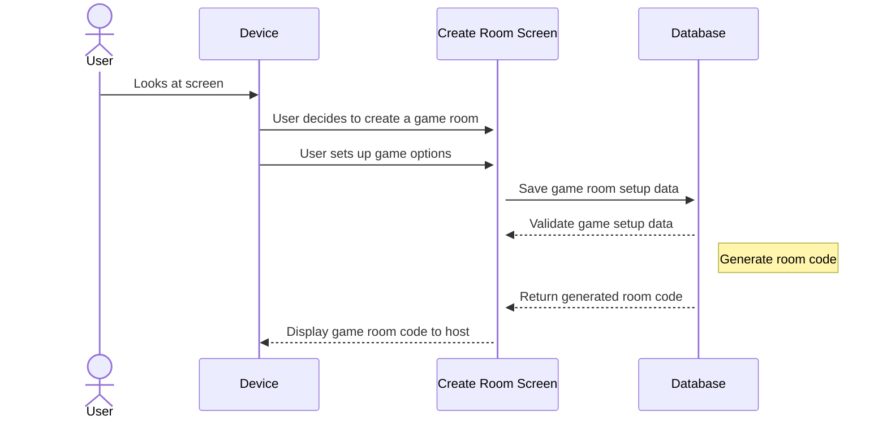
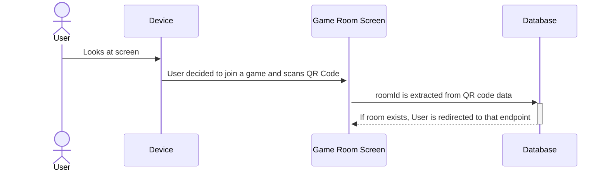
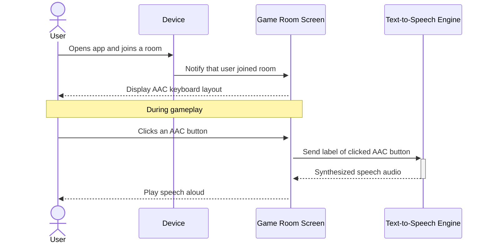
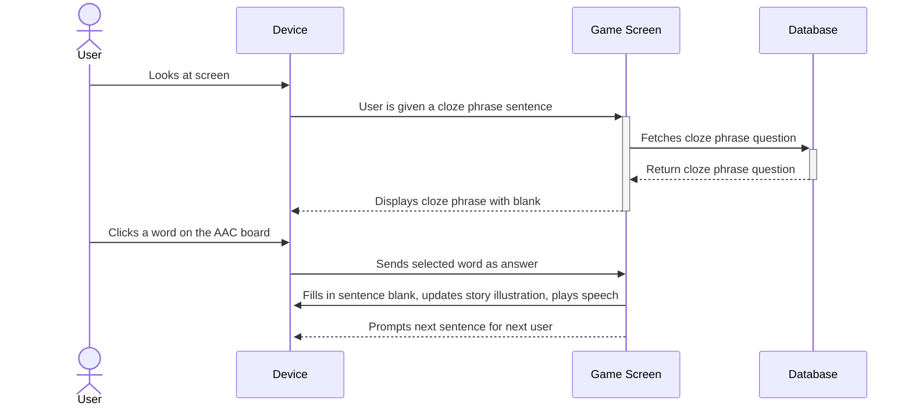
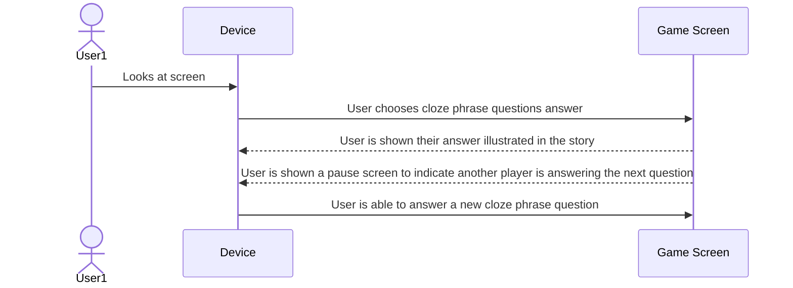
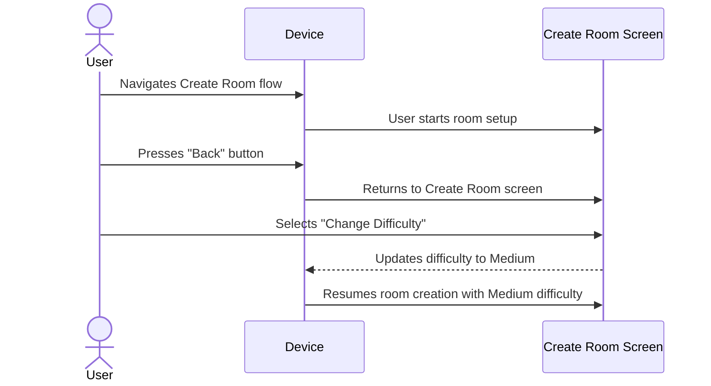

# Use-case Descriptions

## Use Case Sequence Diagrams

## Use Case 1: Room Management - Setting up a new room

[User wants to start a new game room](../requirements/use-case-descriptions.md#user-wants-to-start-a-new-game-room)

1. User opens the game on a device
2. User clicks the "Create a Game Room" button
3. User selects a story type
4. User selects a difficult level
5. User selects the number of players
6. User clicks the "Start" button

Figure 1

## Use Case 2: Room Management - Player Joins a Game through the Join Screen

[User wants to join the game the host has made](../requirements/use-case-descriptions.md#user-wants-to-join-the-game-the-host-has-made)

1. User clicks on the "Join Game" button
2. User scans QR code displayed on the host's screen, clicking 'Capture'.
3. User clicks 'Start Game' and chooses an avatar
3. User is brought to the Gameplay page with all the other players who are participating in the game session

Figure 2
## Use Case 3: Accessibility & AAC

[Users utilize a built-in AAC keyboard](../requirements/use-case-descriptions.md#users-utilize-a-built-in-aac-keyboard)

1. User joins a room. 
2. User is presented with an AAC keyboard layout on the left of their screen during gameplay. 
3. During their turn, the user can click AAC buttons. 
4. When a button is clicked, its label is sent to the device’s speech synthesis engine. 
5. The button’s label is read aloud using synthesized speech. 

Figure 3
## Game Mechanics

## Use Case 4: Cloze Phraze Education - User Chooses an Answer

[User Chooses an Answer](../requirements/use-case-descriptions.md#user-chooses-an-answer)

 
1. User is in a game session using their device. 
2. User is prompted with a line from the story, both audibly and visually, containing a cloze phrase. 
3. User selects an answer by clicking a word on the AAC board. 
4. The chosen word is inserted into the blank in the sentence. 
5. The completed sentence is read aloud using speech synthesis. 
6. The story illustration updates to reflect the new sentence. 
7. The next sentence is automatically shown for the next user. 

Figure 4
## Use Case 5: Collaboration - Users Take Turns Answering a Question

[Users Take Turns Answering a Question](../requirements/use-case-descriptions.md#users-take-turns-answering-a-question)

1. User is in a game session using their device
2. User chooses an answer choice
3. User is shown their story illustrated
4. User is prompted with a pause screen indicating another player is answering 
5. Second player answers 
6. User is now able to answer a new cloze phrase question

Figure 5
## Use Case 6: Difficulty Scaling - User Wants to Change Difficulty

[Users Wants to Change From Easy Mode to Medium Mode](../requirements/use-case-descriptions.md#users-wants-to-change-from-easy-mode-to-medium-mode)

 
1. User is in the Create Room flow on their device. 
2. User decides they want to change from Easy to Medium mode. 
3. User presses the "Back" button to return to settings. 
4. User is shown different settings options and clicks "Medium".
5. User proceeds with room creation and will now answer the number of questions Medium difficulty requires during the game. 

Figure 6
