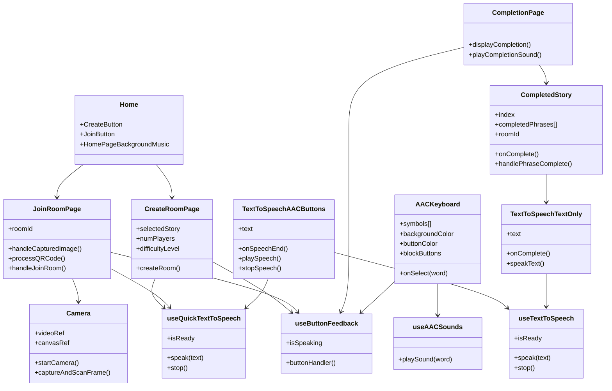
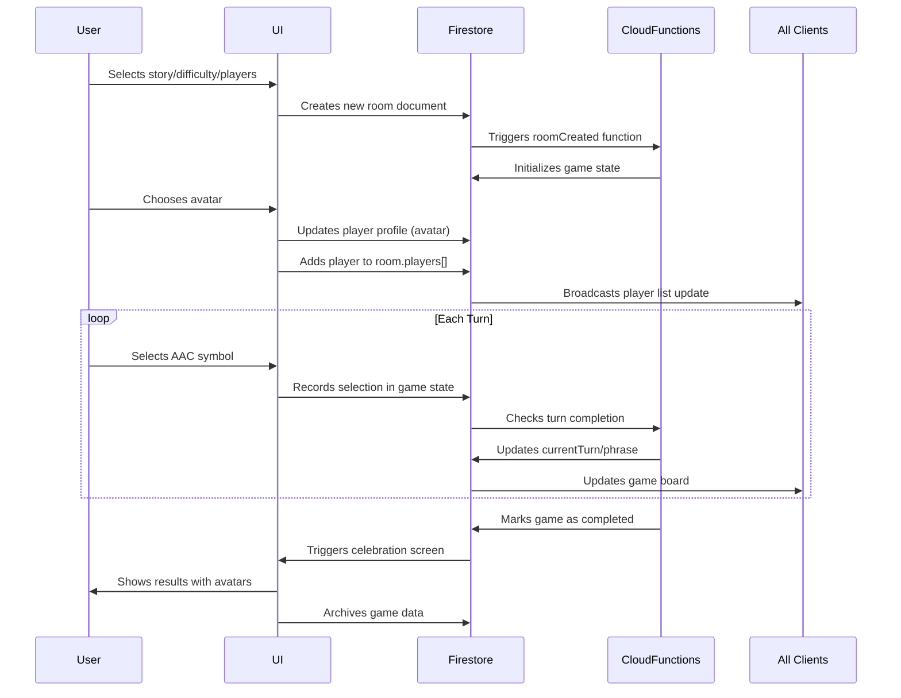
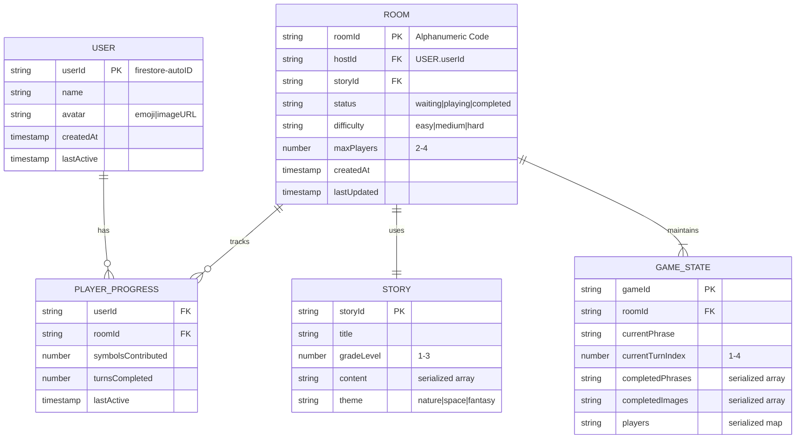

# Design
The front-end client is built with React and Next.js, while the back-end leverages Firebase for real-time database synchronization, authentication, and 
accessible experience for AAC users, incorporating symbol-based communication and text-to-speech capabilities. 

## Components Description
### Client (Front-End)
The client is a React application built with Next.js framework, offering server-side rendering for improved performance and SEO. It provides the user interface that students interact with, including AAC features, story navigation, and room management.

**Technologies Used:**
- React (UI components)
- Next.js (Routing and server-side rendering)
- Tailwind CSS (Responsive and accessible styling)
- Framer Motion (Smooth animations for kids)
- TypeScript (Ease of use in JavaScript)

**Responsibilities:**
- Display the homepage with options to create a profile, create, or join a room.
- Render stories and cloze-phrase questions
- Handle AAC interactions (symbol grids, text-to-speech)
- Communicate with Firebase for real-time updates and authentication
- Provide responsive design for tablets and desktops

**Interface:**
- Firebase SDK: The client uses the Firebase JavaScript SDK for real-time communication with the back-end.
- AAC Symbol Library (ARASAAC): Provides visual symbols for communication

### Server (Back-End)
The back-end services are managed by Firebase, which provides real-time database capabilities, authentication, and cloud functions for game logic. 
This architecture minimizes server management overhead while offering scalability and performance.

**Technologies Used:**
- Firebase Authentication: For secure room joining and session management.
- Firebase Firestore: A NoSQL real-time database to store game data, room information, and group progress.
- Firebase Cloud Functions: To handle server-side logic like validating game answers and managing game state.

**Responsibilities:**
- Manage session tokens.
- Handle real-time game state updates across all players.
- Store and retrieve stories, game progress, and player data.
- Execute server-side logic for game validation

**Interfaces:**
- Client Requests: The client interacts with the server via Firebase SDK calls, which handle real-time data synchronization.
- Cloud Functions Triggers: Automatically execute server-side logic when certain conditions are met (like when a new answer is submitted)

### Class Diagrams

*Figure 1: Class diagram showing interactions between classes within StoryQuest*

This class diagram shows the relationship between different components in the StoryQuest system.

#### Room Management
This section outlines the core frontend pages involved in the multiplayer room lifecycle, from game setup to lobby management and game start. Each page interacts with Firestore and Firebase Cloud Functions to manage real-time multiplayer sessions.

HomePage: The HomePage is the landing interface for users when they first open the application. It offers two primary options:
- `joinRoom()`: Allows a player to join an existing game session via a QR code or room ID. Validates the room ID and redirects the player to the Gameplay page,
- `createRoom()`: Initiates the process of creating a new game room. Redirects the user to the CreateRoom flow for configuration.

CreateRoom: The CreateRoom flow provides game setup tools for the host, allowing them to define the session settings before inviting players.
- `selectStory()`: Lets the host choose a story template from a predefined library. This determines the narrative flow of the game.
- `selectDifficulty()`: Sets the difficulty level of the game (e.g., "easy", "medium", "hard"), impacting pacing or challenge level.
- `selectNumPlayers()`: Specifies the maximum number of players allowed in the game room (up to 4).
- `startGameRoom()`: Finalizes the configuration, creates the room document in Firestore, and transitions the host to the gameplay session.

#### Game Flow Summary

1. The host sets up the game in CreateRoom.
2. Players join a room via JoinRoom on the HomePage.
3. Players wait on a screen on the Gameplay page until the game starts.
4. The game begins on the right panel of Gameplay, displaying a phrase with blanks to fill alongside a background and images.
5. Players take turns selecting answers from the AACBoard on the left panel of Gameplay.
6. The selected word is displayed on the bottom of the right panel of the Gameplay page and sent to the Firestore. 
7. The game continues turn-by-turn until the story is complete.

### Database Schema

#### Collections

###### `users` Collection
| Field | Type | Description | Example |
|-------|------|-------------|---------|
| `userId` | `string` (Primary Key) | Unique identifier | "user_abc123" |
| `name` | `string` | Player's display name | "Player 1" |
| `avatar` | `string` | Emoji or image URL | "🐱" |
| `createdAt` | `timestamp` | Account creation time | `2023-11-15T14:32:00Z` |
| `lastActive` | `timestamp` | Last login time | `2023-11-20T09:15:00Z` |

**Responsibilities:**
- Stores player profiles and preferences
- Tracks user activity

---

###### `rooms` Collection
| Field | Type | Description | Example |
|-------|------|-------------|---------|
| `roomId` | `string` (PK) | Alphanumeric code which turns into a qr code | "ABCDEF" |
| `hostId` | `string` (FK) | Creator's userId | "user_abc123" |
| `players` | `array` | List of userIds | `["user_abc123", "user_xyz456"]` |
| `currentTurn` | `number` | Player turn index | `1` |
| `storyId` | `string` (FK) | Current story | "The Garden Adventure" |
| `difficulty` | `string` | Game level | "medium" |
| `status` | `string` | Game state | "playing" |
| `createdAt` | `timestamp` | Creation time | `2023-11-20T10:00:00Z` |

**Responsibilities:**
- Manages active game sessions
- Tracks turn order
- Stores room configuration

---

###### `games` Collection
| Field | Type | Description | Example |
|-------|------|-------------|---------|
| `gameId` | `string` (PK) | Session ID | "game_123" |
| `roomId` | `string` (FK) | Associated room | "ABCDEF" |
| `currentPhrase` | `string` | Active story segment | "The ___ flew high" |
| `completedPhrases` | `array` | Finished segments | `["The bird", "The bird flew"]` |
| `completedImages` | `array` | Selected images | `[{word: "bird", src: "bird.png"}]` |
| `currentSectionIndex` | `number` | Progress index | `2` |
| `maxPlayers` | `number` | Player limit | `4` |

**Responsibilities:**
- Tracks real-time game state
- Stores completed content
- Maintains player selections

---

###### `stories` Collection
| Field | Type | Description | Example |
|-------|------|-------------|---------|
| `storyId` | `string` (PK) | Unique ID | "story_garden" |
| `title` | `string` | Story title | "Garden Adventure" |
| `gradeLevel` | `number` | Difficulty (1-3) | `1` |
| `content` | `array` | Story segments | `["The ___", "The ___ flew"]` |
| `wordBank` | `map` | AAC symbols | `{"bird": {image: "bird.png", sound: "bird.mp3"}}` |

**Responsibilities:**
- Stores story content
- Provides AAC resources
- Manages grade levels

## Data Flow Diagram

### Database Design
Here is the database section with an Entity-Relationship Diagram 
(ERD) and a table design for StoryQuest. While Firestore is a NoSQL 
database, we represent the structure relationally for design clarity. 
Collections are shown as tables with their key fields.

**Entity-Relationship Diagram**

*Figure 2: An entity-relationship diagram showing interactions within the database*

**Table Design**

Here is how the data would be structured in Firestore. Though Firestore is a NoSQL database, this relational layout helps clarify the relationships.

## Firestore Collection Structure

### `users` Collection (Figure 3)
| Field | Type | Description | Example |
|-------|------|-------------|---------|
| `userId` (PK) | string | Firebase Auth UID | "xZ8jyT..." |
| `name` | string | Player's display name | "Player 1" |
| `avatar` | string | Emoji or image URL | "🦊" |
| `aacSettings` | map | User preferences | `{ voiceSpeed: 1.2, theme: "dark" }` |
| `createdAt` | timestamp | Account creation | `2023-11-20T09:15:00Z` |
| `lastActive` | timestamp | Last login time | `2023-11-25T14:30:00Z` |

### `rooms` Collection (Figure 4)
| Field | Type | Description | Validation |
|-------|------|-------------|------------|
| `roomId` (PK) | string | 6-digit room code | "ABCD12" |
| `hostId` | string (FK) | Creator's userId | Required |
| `storyId` | string (FK) | Selected story | Required |
| `difficulty` | string | Game level | "easy"/"medium"/"hard" |
| `maxPlayers` | number | Player limit | 2-4 |
| `currentTurn` | number | Turn index (1-4) | 1 |
| `status` | string | Game state | "waiting"/"playing"/"completed" |
| `createdAt` | timestamp | Creation time | Auto-set |
| `timeLimit` | number | Turn timer (seconds) | Optional |

### `roomPlayers` Subcollection
| Field | Type | Description | Notes |
|-------|------|-------------|-------|
| `userId` (PK) | string (FK) | Player reference | Indexed |
| `name` | string | Display name | Copied from user |
| `avatar` | string | Player icon | "🐶" |
| `turnOrder` | number | Player sequence | 1-4 |
| `joinedAt` | timestamp | Join time | Auto-set |

### `stories` Collection (Figure 6)
| Field | Type | Description | Example |
|-------|------|-------------|---------|
| `storyId` (PK) | string | Unique ID | "garden-1" |
| `title` | string | Story title | "Magic Garden" |
| `difficulty` | number | Difficulty | 1-3 |
| `content` | array | Phrase segments | `["The ___", "sat on the ___"]` |
| `wordBank` | map | AAC resources | `{apple: {image: "apple.png", sound: "apple.mp3"}}` |

### `gameState` Subcollection (within rooms)
| Field | Type | Description |
|-------|------|-------------|
| `currentPhrase` | string | Active story segment |
| `completedPhrases` | array | Filled segments |
| `selectedSymbols` | array | `{word: "apple", by: "user123", avatar: "🐱"}` |
| `currentTurn` | number | Turn index |
| `lastUpdated` | timestamp | Auto-updated |

